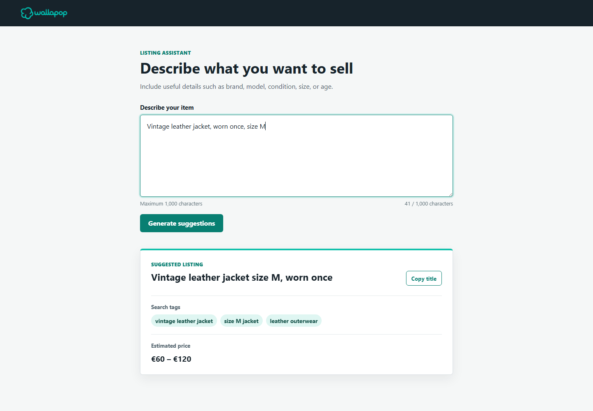
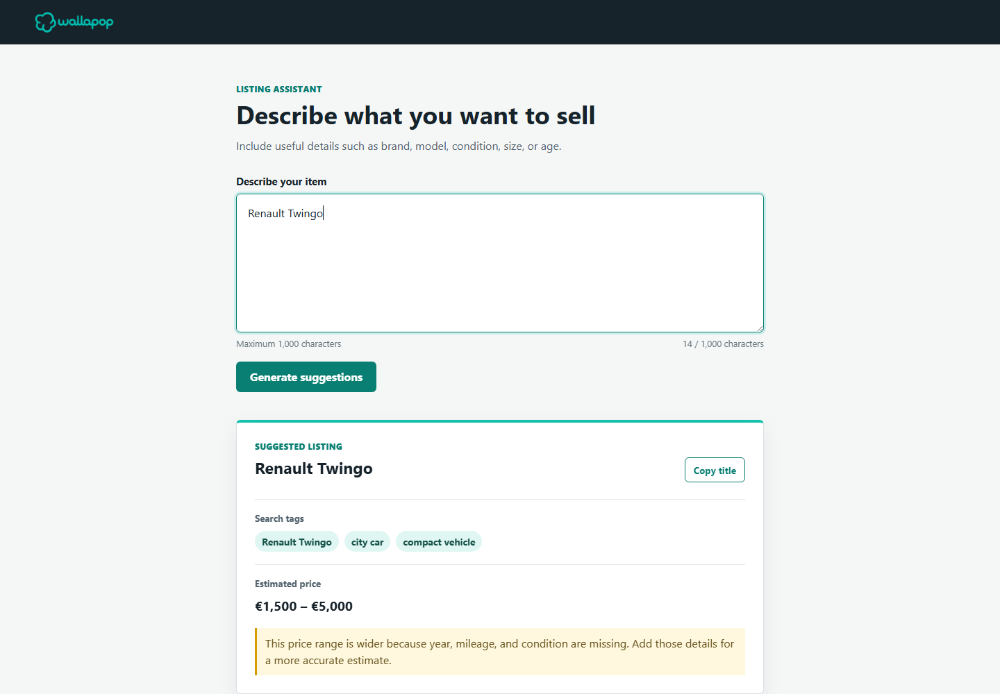

# Wallapop Listing Assistant

A small full-stack assistant that helps sellers turn a rough item description into a clearer and more useful listing.

Given a description, it suggests:

* a concise marketplace title
* 3–5 buyer-oriented search tags
* an estimated EUR price range
* additional guidance when more product information would improve the estimate

The application consists of one React screen and one Express endpoint, with either Groq or deterministic mock responses.



## Features

The main seller flow is intentionally small:

```text
Seller description
        ↓
Generate suggestions
        ↓
Title + tags + price range
        ↓
Copy title if useful
```

The application:

* accepts free-form descriptions up to 1,000 characters
* handles both detailed and incomplete seller input
* still provides useful suggestions when an item is identifiable but underspecified
* asks for clarification when the item itself cannot be identified
* supports copying the generated title
* handles loading, validation, provider failures and invalid model output
* prevents late responses from appearing beside an edited description
* validates every real and mocked model response at runtime

The input behaviour was manually checked across detailed, incomplete, vague and invalid cases.



## Requirements

* Node.js `^20.19.0` or `>=22.12.0`
* npm

## Quick Start

Install dependencies:

```bash
npm ci
```

Start frontend and backend:

```bash
npm run dev
```

Open:

```text
http://localhost:5173
```

The application starts in the default `valid` mock mode.

Enter a product description and click **Generate suggestions**, exactly as in real-model mode. The backend simply returns a deterministic fixture instead of calling Groq.

Recommended first input:

```text
Vintage leather jacket, worn once, size M
```

No `.env` file or API key is required.

## Mock Mode

The mock uses fixed fixtures and does not analyse the description semantically.

To select another scenario, create `.env` from `.env.example`:

```dotenv
MODEL_PROVIDER=mock
MOCK_SCENARIO=limited
```

| Scenario                 | Recommended input                           | Behaviour                                    |
| ------------------------ | ------------------------------------------- | -------------------------------------------- |
| `valid`                  | `Vintage leather jacket, worn once, size M` | Complete suggestions                         |
| `limited`                | `Renault Twingo`                            | Suggestions with wider estimate and guidance |
| `needs_more_information` | `Something from my garage`                  | Requests identifying information             |
| `invalid`                | Any non-empty text                          | Simulates malformed model output             |

Restart the backend after changing `.env`.

## Real Groq Mode

Configure:

```dotenv
MODEL_PROVIDER=groq
GROQ_API_KEY=your_key_here
```

Then run:

```bash
npm run dev
```

Groq was selected after comparing the available options because it provided a lightweight way to integrate and experiment with a real model without adding infrastructure unrelated to the task.

The integration uses `openai/gpt-oss-20b` through Groq's OpenAI-compatible API, with JSON Object Mode, temperature `0.5`, seed `42`, a 30-second timeout and at most one retry.

The prompt defines the expected behaviour and response shape, while application-side parsing and validation enforce the contract used by the rest of the system.

## Architecture

```text
React UI
   ↓
Frontend request client
   ↓
Express endpoint
   ↓
Listing generation flow
   ↓
Model boundary
   ├── Groq
   └── Mock
   ↓
Runtime validation
   ↓
Trusted application result
```

The architecture was deliberately kept small.

The real and mock providers share a minimal model boundary, allowing either implementation to be used without changing the core generation flow.

Model output is treated as untrusted data and is validated before becoming application data.

Main modules:

* `src/frontend/App.tsx` — UI and interaction state
* `src/frontend/listingSuggestionsApi.ts` — frontend API client
* `src/backend/app.ts` — endpoint and HTTP status mapping
* `src/backend/generateListingSuggestions.ts` — generation flow
* `src/backend/groqModel.ts` — Groq integration and prompt
* `src/backend/mockModel.ts` — deterministic scenarios
* `src/backend/parseListingSuggestions.ts` — model-output validation
* `src/shared/listingSuggestions.ts` — shared application contract

## API

`POST /api/listing-suggestions`

```json
{
  "description": "Vintage leather jacket, worn once, size M"
}
```

Example response:

```json
{
  "status": "complete",
  "title": "Vintage leather jacket size M, worn once",
  "tags": [
    "vintage leather jacket",
    "size M jacket",
    "leather outerwear"
  ],
  "priceRange": {
    "min": 60,
    "max": 120,
    "currency": "EUR"
  }
}
```

A `limited` result also contains guidance for improving the estimate.

`needs_more_information` asks for clarification without inventing suggestions.

HTTP `400` is used for invalid input, `502` for structurally invalid model output, and `503` for provider failures.

## Verification

```bash
npm test
npm run typecheck
npm run build
```

The test suite focuses on behaviour rather than coverage percentage, including:

* generation flow
* runtime model validation
* different seller-input states
* mock scenarios
* provider and invalid-output failures
* frontend interaction and stale-response protection

At the time of delivery:

* 9 test files
* 42 passing tests
* TypeScript check passing
* frontend production build passing
* no known vulnerabilities reported by `npm audit`

## Commands

| Command                | Purpose                    |
| ---------------------- | -------------------------- |
| `npm run dev`          | Start frontend and backend |
| `npm run dev:frontend` | Start Vite only            |
| `npm run dev:backend`  | Start Express only         |
| `npm test`             | Run tests once             |
| `npm run test:watch`   | Run tests in watch mode    |
| `npm run typecheck`    | Run TypeScript checks      |
| `npm run build`        | Build the frontend         |

Deployment infrastructure and production serving are outside the scope of this take-home.

## Current Limitations

Price ranges come from the model's general knowledge rather than live Wallapop listings or comparable-sales data.

Real-model output is not fully deterministic. I experimented with prompt changes, temperature and seed settings to improve consistency; results improved, but identical or similar inputs can still vary.

Short or language-neutral descriptions may occasionally produce language drift, and model-generated titles, tags and prices still require seller review.

The mock validates application behaviour, not semantic model quality.

Persistence, result history, category-specific fields and a complete edit/regeneration workflow were considered but intentionally left outside the current scope.

## With Four More Hours

I would first refine and evaluate the prompts across a broader set of seller inputs, particularly to improve price, tag and incomplete-input consistency.

With a reliable approved data source, a more substantial improvement would be grounding price estimation in real marketplace or comparable-sales data. I considered that well beyond the intended scope of this task.

I would prioritise improving the quality of the existing experience before expanding the feature set.

## Time Spent

Approximately **8 hours** across product discussion, implementation, testing, real-model experimentation and documentation.

A significant part of that time was spent before implementation, defining the seller experience, prioritising functionality and discussing the minimum architecture required to support it.

## AI-Assisted Development

The main AI-assisted decisions, failed assumptions and model interactions are summarised in [`AI_JOURNEY.md`](AI_JOURNEY.md).

The chronological working log is available in [`AI_resources/AI_JOURNEY_NOTES.md`](AI_resources/AI_JOURNEY_NOTES.md).
